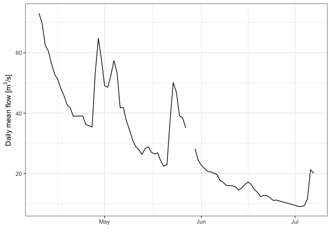

<!-- README.md is generated from README.Rmd. Please edit that file -->

# ea

<!-- badges: start -->

[](https://github.com/simonmoulds/ea/actions/workflows/R-CMD-check.yaml)
<!-- badges: end -->

The ea package provides access to Environment Agency (EA) Hydrology API.

## Installation

You can install the development version of ea from
[GitHub](https://github.com/) with:

``` r
devtools::install_github("simonmoulds/ea")
```

## Example

Here is a basic example that shows you how to use the package to
download streamflow timeseries data from the EA Hydrology API:

``` r
library(dplyr)
library(lubridate)
library(ggplot2)
library(ea)
```

First we get discharge stations on the River Thames within 5km of
Abingdon:

``` r
stns <- ea_station_list(
  sample_of = "River Thames", observed_property = "waterFlow",
  lat = 51.6708, long = -1.2880, dist = 5
)
stns
#> # A tibble: 1 × 21
#>   `@id`  label notation easting northing   lat  long type  riverName stationGuid
#>   <chr>  <chr> <chr>      <int>    <int> <dbl> <dbl> <lis> <chr>     <chr>      
#> 1 http:… Sutt… b0713e8…  451702   194623  51.6 -1.25 <df>  River Th… b0713e87-c…
#> # ℹ 11 more variables: stationReference <chr>, wiskiID <chr>, RLOIid <chr>,
#> #   rloiStationLink <df[,1]>, catchmentArea <dbl>, dateOpened <chr>,
#> #   nrfaStationID <chr>, nrfaStationURL <chr>, observedProperty <list>,
#> #   status <list>, measures <list>
```

There is only one station available. We extract its global unique
identifier (GUID), and use `ea_timeseries_list` to retrieve the
available timeseries data:

``` r
guid <- stns$stationGuid
tslist <- ea_timeseries_list(guid)
tslist
#> # A tibble: 7 × 15
#>   `@id`       label parameter parameterName notation period periodName valueType
#>   <chr>       <chr> <chr>     <chr>         <chr>     <int> <chr>      <chr>    
#> 1 http://env… Dail… flow      Flow          b0713e8…  86400 daily      mean     
#> 2 http://env… Dail… flow      Flow          b0713e8…  86400 daily      min      
#> 3 http://env… Dail… flow      Flow          b0713e8…  86400 daily      max      
#> 4 http://env… 15mi… flow      Flow          b0713e8…    900 15min      instanta…
#> 5 http://env… Dail… level     Level         b0713e8…  86400 daily      max      
#> 6 http://env… 15mi… level     Level         b0713e8…    900 15min      instanta…
#> 7 http://env… Dail… level     Level         b0713e8…  86400 daily      min      
#> # ℹ 7 more variables: valueStatistic <df[,2]>, observationType <df[,2]>,
#> #   observedProperty <df[,2]>, station <df[,5]>, unit <df[,1]>, unitName <chr>,
#> #   hasTelemetry <lgl>
```

We can see that there are several timeseries available for this station,
each referenced with a unique measurement ID provided in the `notation`
column. We retrieve the ID for daily mean flow:

``` r
measure <- tslist |>
  filter(period == 86400 & valueType == "mean") |> 
  pull(notation)
measure
#> [1] "b0713e87-cab3-46e4-bfb3-f0bbb91cedf6-flow-m-86400-m3s-qualified"
```

We can use the measurement ID to retrieve the timeseries data:

``` r
min_date <- Sys.Date() %m-% months(3)
ts <- ea_timeseries_values(measure, min_date = min_date)
ts
#> # A tibble: 84 × 9
#>    measure       date       dateTime            value completeness quality valid
#>    <chr>         <date>     <dttm>              <dbl> <chr>        <chr>   <chr>
#>  1 b0713e87-cab… 2024-04-18 2024-04-18 00:00:00  45.8 Complete     Good    <NA> 
#>  2 b0713e87-cab… 2024-04-22 2024-04-22 00:00:00  39.0 Complete     Good    <NA> 
#>  3 b0713e87-cab… 2024-04-25 2024-04-25 00:00:00  36.1 Complete     Good    <NA> 
#>  4 b0713e87-cab… 2024-04-27 2024-04-27 00:00:00  35.4 Complete     Good    <NA> 
#>  5 b0713e87-cab… 2024-04-30 2024-04-30 00:00:00  57.8 Complete     Good    <NA> 
#>  6 b0713e87-cab… 2024-04-28 2024-04-28 00:00:00  53.1 Complete     Good    <NA> 
#>  7 b0713e87-cab… 2024-04-29 2024-04-29 00:00:00  64.8 Complete     Good    <NA> 
#>  8 b0713e87-cab… 2024-05-26 2024-05-26 00:00:00  38.5 Complete     Good    <NA> 
#>  9 b0713e87-cab… 2024-05-20 2024-05-20 00:00:00  22.4 Complete     Good    <NA> 
#> 10 b0713e87-cab… 2024-05-28 2024-05-28 00:00:00  NA   Incomplete   Missing <NA> 
#> # ℹ 74 more rows
#> # ℹ 2 more variables: invalid <chr>, missing <chr>
```

Alternatively, we can supply the station GUID and some additional
parameters to retrieve the timeseries data:

``` r
ts <- ea_timeseries_values(
  station_guid = guid, observed_property = "waterFlow",
  value_type = "mean", period = 86400, min_date = min_date
)
ts
#> # A tibble: 84 × 9
#>    measure       date       dateTime            value completeness quality valid
#>    <chr>         <date>     <dttm>              <dbl> <chr>        <chr>   <chr>
#>  1 b0713e87-cab… 2024-04-18 2024-04-18 00:00:00  45.8 Complete     Good    <NA> 
#>  2 b0713e87-cab… 2024-04-22 2024-04-22 00:00:00  39.0 Complete     Good    <NA> 
#>  3 b0713e87-cab… 2024-04-25 2024-04-25 00:00:00  36.1 Complete     Good    <NA> 
#>  4 b0713e87-cab… 2024-04-27 2024-04-27 00:00:00  35.4 Complete     Good    <NA> 
#>  5 b0713e87-cab… 2024-04-30 2024-04-30 00:00:00  57.8 Complete     Good    <NA> 
#>  6 b0713e87-cab… 2024-04-28 2024-04-28 00:00:00  53.1 Complete     Good    <NA> 
#>  7 b0713e87-cab… 2024-04-29 2024-04-29 00:00:00  64.8 Complete     Good    <NA> 
#>  8 b0713e87-cab… 2024-05-26 2024-05-26 00:00:00  38.5 Complete     Good    <NA> 
#>  9 b0713e87-cab… 2024-05-20 2024-05-20 00:00:00  22.4 Complete     Good    <NA> 
#> 10 b0713e87-cab… 2024-05-28 2024-05-28 00:00:00  NA   Incomplete   Missing <NA> 
#> # ℹ 74 more rows
#> # ℹ 2 more variables: invalid <chr>, missing <chr>
```

Once we have obtained the data we can plot the timeseries:



<!-- README.md is generated from README.Rmd. Please edit that file -->
