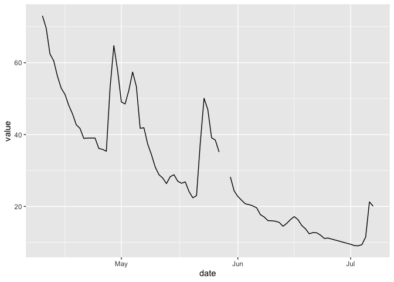

<!-- README.md is generated from README.Rmd. Please edit that file -->

# ea

<!-- badges: start -->

[](https://github.com/simonmoulds/ea/actions/workflows/R-CMD-check.yaml)
<!-- badges: end -->

The sepa package provides access to environmental data collected by the
Scottish Environment Protection Agency (SEPA).

## Installation

You can install the development version of sepa from
[GitHub](https://github.com/) with:

``` r
devtools::install_github("simonmoulds/ea")
#> Skipping install of 'ea' from a github remote, the SHA1 (f51c73e2) has not changed since last install.
#>   Use `force = TRUE` to force installation
```

## Example

This is a basic example which shows you how to solve a common problem:

``` r
library(dplyr)
#> 
#> Attaching package: 'dplyr'
#> The following objects are masked from 'package:stats':
#> 
#>     filter, lag
#> The following objects are masked from 'package:base':
#> 
#>     intersect, setdiff, setequal, union
```

``` r
library(lubridate)
#> 
#> Attaching package: 'lubridate'
#> The following objects are masked from 'package:base':
#> 
#>     date, intersect, setdiff, union
```

``` r
library(ggplot2)
library(ea)
```

The steps required to download historical streamflow data are outlined
below:

``` r
stns <- ea_station_list(observed_property = "waterFlow")
# Choose arbitrary station
stn_id <- stns$notation[1]
available_ts <- ea_timeseries_list(stn_id)
# Get the timeseries ID for daily mean flow
ts_id <- available_ts |> 
  filter(parameter == "flow" & period == 86400 & valueType == "mean") |> 
  pull(notation)
# Retrieve data
ts <- ea_timeseries_values(measure = ts_id, min_date = Sys.Date() %m-% months(1))
head(ts)
#> # A tibble: 6 × 9
#>   measure             date       dateTime            value valid invalid missing
#>   <chr>               <date>     <dttm>              <dbl> <chr> <chr>   <chr>  
#> 1 052d0819-2a32-47df… 2024-06-22 2024-06-22 00:00:00  1.12 10000 0       0      
#> 2 052d0819-2a32-47df… 2024-06-23 2024-06-23 00:00:00  1.12 8229  0       1770   
#> 3 052d0819-2a32-47df… 2024-06-05 2024-06-05 00:00:00  1.15 <NA>  <NA>    <NA>   
#> 4 052d0819-2a32-47df… 2024-06-06 2024-06-06 00:00:00  1.11 <NA>  <NA>    <NA>   
#> 5 052d0819-2a32-47df… 2024-05-31 2024-05-31 00:00:00  1.47 <NA>  <NA>    <NA>   
#> 6 052d0819-2a32-47df… 2024-06-01 2024-06-01 00:00:00  1.32 <NA>  <NA>    <NA>   
#> # ℹ 2 more variables: completeness <chr>, quality <chr>
```

Once we have obtained the data we can plot the timeseries:



<!-- README.md is generated from README.Rmd. Please edit that file -->
